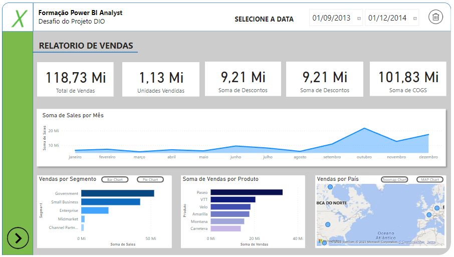
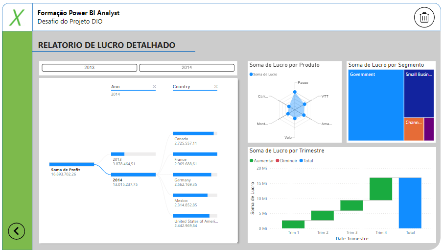
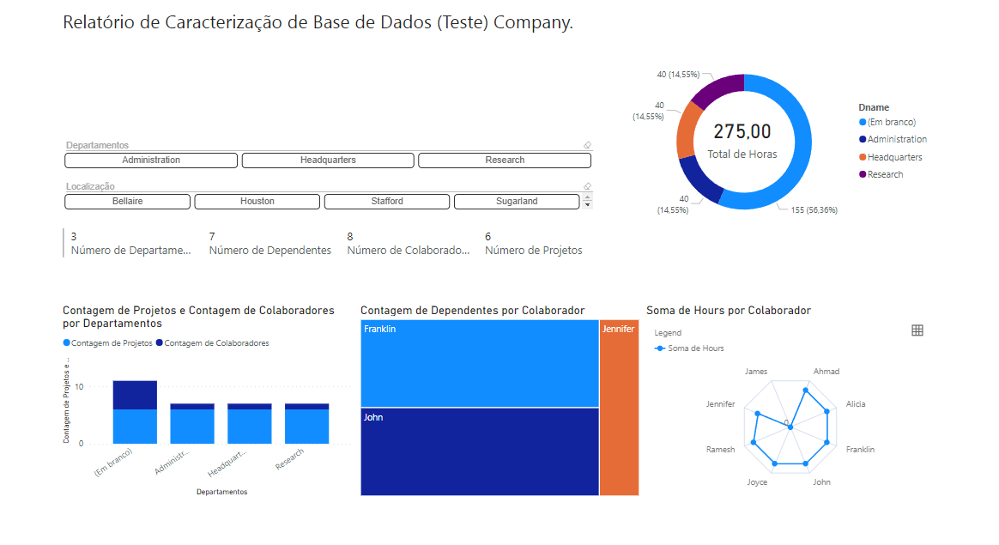

# power_bi_analyst

Repositório relacionado a formação de Power BI Analyst

# Desafio de Power BI - Relatório Financeiro

Neste projeto, participei de um desafio que me permitiu aprimorar minhas habilidades em Power BI e criar um relatório financeiro mais elaborado. Durante o desafio, adquiri e utilizei conhecimentos em:

- Importação de dados financeiros a partir de arquivos CSV.
- Criação de layouts de relatórios eficazes, incluindo grids, caixas de texto e imagens.
- Desenvolvimento de gráficos e visualizações de dados significativas com base nos dados de amostra fornecidos.
- Implementação de botões de navegação para facilitar a alternância entre páginas e visuais diferentes.
- Uso de segmentadores de dados para permitir a interação dos usuários com o relatório.
- Publicação do relatório no Power BI Service para compartilhamento online.
- Uso Personalizações avançadas, como ações personalizadas nos botões.

Este projeto demonstra meu comprometimento em explorar e aplicar conceitos de Business Intelligence, fornecendo uma amostra de meu portfólio de projetos técnicos no Power BI. Ele reflete minha capacidade de criar relatórios informativos e interativos, que podem ser valiosos para tomadas de decisão informadas.






Este desafio é uma parte essencial do meu contínuo desenvolvimento em análise de dados e visualização, e estou ansioso para receber feedback e aprimorar ainda mais minhas habilidades.

Obrigado por conferir este projeto!

# Desafio - Processando e Transformando Dados com Power BI

Neste desafio, foi realizado uma série de etapas para transformar e manipular dados em um banco de dados usando SQL. Abaixo estão as etapas e os comandos que foram utilizados para cada uma delas:

### Parte 1: Conectar-se ao Servidor MySQL no Azure e Criação das Tabelas

Utilize o seguinte comando para se conectar ao servidor MySQL no Azure:

```shell

mysql -h NOME_DO_SERVIDOR -u SEU_USUARIO -p SENHA

create schema if not exists azure_company;

use azure_company;

-- Criação da tabela "employee"

CREATE TABLE employee (
    Fname varchar(15) not null,
    Minit char,
    Lname varchar(15) not null,
    Ssn char(9) not null, 
    Bdate date,
    Address varchar(30),
    Sex char,
    Salary decimal(10,2),
    Super_ssn char(9),
    Dno int not null default 1,
    constraint chk_salary_employee check (Salary > 2000.0),
    constraint pk_employee primary key (Ssn)
);

-- Criação da tabela "department"

CREATE TABLE department (
    Dname varchar(15) not null,
    Dnumber int not null,
    Mgr_ssn char(9) not null,
    Mgr_start_date date, 
    Dept_create_date date,
    constraint chk_date_dept check (Dept_create_date < Mgr_start_date),
    constraint pk_dept primary key (Dnumber),
    constraint unique_name_dept unique (Dname),
    foreign key (Mgr_ssn) references employee(Ssn)
);

-- Correção erro: chave estrangeira na tabela chamada 'departament'.

SHOW CREATE TABLE departament;

-- Procurar a definição da chave estrangeira correta e usar o nome correto da chave estrangeira ao tentar removê-la.

ALTER TABLE departament DROP FOREIGN KEY departament_ibfk_1;

-- Criação da tabela "dept_locations"

CREATE TABLE dept_locations (
    Dnumber int not null,
    Dlocation varchar(15) not null,
    constraint pk_dept_locations primary key (Dnumber, Dlocation),
    constraint fk_dept_locations foreign key (Dnumber) references department (Dnumber)
);

-- Removendo a chave estrangeira 'fk_dept_locations'

ALTER TABLE dept_locations DROP FOREIGN KEY fk_dept_locations;

-- Criação da tabela "project"

CREATE TABLE project (
    Pname varchar(15) not null,
    Pnumber int not null,
    Plocation varchar(15),
    Dnum int not null,
    primary key (Pnumber),
    constraint unique_project unique (Pname),
    constraint fk_project foreign key (Dnum) references department (Dnumber)
);

-- Criação da tabela "works_on"

CREATE TABLE works_on (
    Essn char(9) not null,
    Pno int not null,
    Hours decimal(3,1) not null,
    primary key (Essn, Pno),
    constraint fk_employee_works_on foreign key (Essn) references employee (Ssn),
    constraint fk_project_works_on foreign key (Pno) references project (Pnumber)
);

-- Criação da tabela "dependent"
-- OBSERVAÇÃO: O comando 'drop table dependent;' gerou um erro, pois a tabela 'dependent' não existia previamente. Portanto, a tabela foi criada em seguida.

CREATE TABLE dependent (
    Essn char(9) not null,
    Dependent_name varchar(15) not null,
    Sex char,
    Bdate date,
    Relationship varchar(8),
    primary key (Essn, Dependent_name),
    constraint fk_dependent foreign key (Essn) references employee (Ssn)
);

show tables;

```
### Parte 2: Populando as Tabelas com o Dados


Solução Executada:

```shell

-- Passo 1: Verificando as Tabelas no Banco de Dados

mysql> show databases;

mysql> use azure_company;

-- Passo 2: Inserção de Dados na Tabela "employee" sql

insert into employee values ('John', 'B', 'Smith', 123456789, '1965-01-09', '731-Fondren-Houston-TX', 'M', 30000, 333445555, 5),
							('Franklin', 'T', 'Wong', 333445555, '1955-12-08', '638-Voss-Houston-TX', 'M', 40000, 888665555, 5),
                            ('Alicia', 'J', 'Zelaya', 999887777, '1968-01-19', '3321-Castle-Spring-TX', 'F', 25000, 987654321, 4),
                            ('Jennifer', 'S', 'Wallace', 987654321, '1941-06-20', '291-Berry-Bellaire-TX', 'F', 43000, 888665555, 4),
                            ('Ramesh', 'K', 'Narayan', 666884444, '1962-09-15', '975-Fire-Oak-Humble-TX', 'M', 38000, 333445555, 5),
                            ('Joyce', 'A', 'English', 453453453, '1972-07-31', '5631-Rice-Houston-TX', 'F', 25000, 333445555, 5),
                            ('Ahmad', 'V', 'Jabbar', 987987987, '1969-03-29', '980-Dallas-Houston-TX', 'M', 25000, 987654321, 4),
                            ('James', 'E', 'Borg', 888665555, '1937-11-10', '450-Stone-Houston-TX', 'M', 55000, NULL, 1);


-- Corrigindo o erro que ocorre devido a uma chave estrangeira não atendida na tabela employee com a coluna Super_ssn sem valor válido.

-- Abordagem: Envolve a inserção de registros na tabela employee sem especificar um valor para a coluna Super_ssn, o que é válido para funcionários sem supervisores definidos.

-- Novo comando para a Inserção na Tabela Em 'employee'

INSERT INTO employee (Fname, Minit, Lname, Ssn, Bdate, Address, Sex, Salary, Dno) VALUES 
('John', 'B', 'Smith', 123456789, '1965-01-09', '731-Fondren-Houston-TX', 'M', 30000, 5),
('Franklin', 'T', 'Wong', 333445555, '1955-12-08', '638-Voss-Houston-TX', 'M', 40000, 5),
('Alicia', 'J', 'Zelaya', 999887777, '1968-01-19', '3321-Castle-Spring-TX', 'F', 25000, 4),
('Jennifer', 'S', 'Wallace', 987654321, '1941-06-20', '291-Berry-Bellaire-TX', 'F', 43000, 4),
('Ramesh', 'K', 'Narayan', 666884444, '1962-09-15', '975-Fire-Oak-Humble-TX', 'M', 38000, 5),
('Joyce', 'A', 'English', 453453453, '1972-07-31', '5631-Rice-Houston-TX', 'F', 25000, 5),
('Ahmad', 'V', 'Jabbar', 987987987, '1969-03-29', '980-Dallas-Houston-TX', 'M', 25000, 4),
('James', 'E', 'Borg', 888665555, '1937-11-10', '450-Stone-Houston-TX', 'M', 55000, 1);


insert into dependent values (333445555, 'Alice', 'F', '1986-04-05', 'Daughter'),
							 (333445555, 'Theodore', 'M', '1983-10-25', 'Son'),
                             (333445555, 'Joy', 'F', '1958-05-03', 'Spouse'),
                             (987654321, 'Abner', 'M', '1942-02-28', 'Spouse'),
                             (123456789, 'Michael', 'M', '1988-01-04', 'Son'),
                             (123456789, 'Alice', 'F', '1988-12-30', 'Daughter'),
                             (123456789, 'Elizabeth', 'F', '1967-05-05', 'Spouse');

insert into departament values ('Research', 5, 333445555, '1988-05-22','1986-05-22'),
							   ('Administration', 4, 987654321, '1995-01-01','1994-01-01'),
                               ('Headquarters', 1, 888665555,'1981-06-19','1980-06-19');

insert into dept_locations values (1, 'Houston'),
								 (4, 'Stafford'),
                                 (5, 'Bellaire'),
                                 (5, 'Sugarland'),
                                 (5, 'Houston');

insert into project values ('ProductX', 1, 'Bellaire', 5),
						   ('ProductY', 2, 'Sugarland', 5),
						   ('ProductZ', 3, 'Houston', 5),
                           ('Computerization', 10, 'Stafford', 4),
                           ('Reorganization', 20, 'Houston', 1),
                           ('Newbenefits', 30, 'Stafford', 4)
;

insert into works_on values (123456789, 1, 32.5),
							(123456789, 2, 7.5),
                            (666884444, 3, 40.0),
                            (453453453, 1, 20.0),
                            (453453453, 2, 20.0),
                            (333445555, 2, 10.0),
                            (333445555, 3, 10.0),
                            (333445555, 10, 10.0),
                            (333445555, 20, 10.0),
                            (999887777, 30, 30.0),
                            (999887777, 10, 10.0),
                            (987987987, 10, 35.0),
                            (987987987, 30, 5.0),
                            (987654321, 30, 20.0),
                            (987654321, 20, 15.0),
                            (888665555, 20, 0.0);


```

### Parte 3: Resolução dos tópicos do Desafio descrito no Modulo 3

```shell

-- 1. Verifique os cabeçalhos e tipos de dados

DESCRIBE employee;
DESCRIBE dependent;
DESCRIBE department;
DESCRIBE dept_locations;
DESCRIBE project;
DESCRIBE works_on;

-- 2. Modifique os valores monetários para o tipo double preciso

UPDATE employee
SET Salary = CAST(Salary AS DECIMAL(10, 2));

-- 3. Verifique a existência dos nulos e analise a remoção

-- Exemplo Comando:

SELECT * FROM employee WHERE Super_ssn IS NULL;

DELETE FROM employee WHERE Super_ssn IS NULL;

-- 4. Verifique se há algum colaborador sem gerente

-- Os employees com nulos em Super_ssn podem ser os gerentes
-- Atualizados registros oonde Super_ssn = nulo para que os funcionarios sejam o seu proprio gerente.

UPDATE employee
SET Super_ssn = Ssn
WHERE Super_ssn IS NULL;

-- 5. Verifique se há algum departamento sem gerente

-- Verificando departamentos sem gerente
SELECT Dnumber, Dname
FROM departament
WHERE Dnumber NOT IN (SELECT DISTINCT Mgr_ssn FROM departament);

-- 6. Se houver departamento sem gerente, suponha que você possui os dados e preencha as lacunas

UPDATE departament
SET Mgr_ssn = '123456789'
WHERE Dnumber IN (5, 4, 1);

-- 7. Verifique o número de horas dos projetos

SELECT Pname, Pnumber, SUM(Hours) AS TotalHours
FROM works_on
JOIN project ON works_on.Pno = project.Pnumber
GROUP BY Pname, Pnumber;

-- 8. Separar colunas complexas

-- Para separar colunas complexas, podemos criar novas colunas derivadas de colunas existentes ou dividir informações complexas em partes mais simples.

-- 9. Mesclar consultas employee e departament

CREATE TABLE EmployeeWithDepartment AS
SELECT e.*, d.Dname AS DepartmentName
FROM employee e
LEFT JOIN departament d ON e.Dno = d.Dnumber;

-- 10. Neste processo elimine as colunas desnecessárias

-- Remoção das colunas "Minit" e "Super_ssn" da tabela EmployeeWithDepartment

ALTER TABLE EmployeeWithDepartment
DROP COLUMN Minit,
DROP COLUMN Super_ssn;

-- 11. Realize a junção dos colaboradores e respectivos nomes dos gerentes

SELECT
  e.Fname AS EmployeeFirstName,
  e.Lname AS EmployeeLastName,
  e.DepartmentName AS EmployeeDepartment,
  m.Fname AS ManagerFirstName,
  m.Lname AS ManagerLastName
FROM EmployeeWithDepartment e
LEFT JOIN EmployeeWithDepartment m ON e.Dno = m.Dno;

-- 12. Mescle as colunas de Nome e Sobrenome

-- Criando a coluna 'EmployeeName' na tabela 'EmployeeWithDepartment'

ALTER TABLE EmployeeWithDepartment
ADD COLUMN EmployeeName VARCHAR(30);

UPDATE EmployeeWithDepartment
SET EmployeeName = CONCAT(Fname, ' ', Lname);

-- 13. Mescle os nomes de departamentos e localização

-- Criando nova Coluna chamada 'DepartmentLocation' à tabela 'EmployeeWithDepartment'

ALTER TABLE EmployeeWithDepartment
ADD COLUMN DepartmentLocation VARCHAR(50);

-- Atualizando a nova coluna com a junção dos valores 'DepartmentName' e 'Location'

UPDATE EmployeeWithDepartment e
JOIN departament d ON e.DepartmentName = d.Dname
JOIN dept_locations l ON d.Dnumber = l.Dnumber
SET e.DepartmentLocation = CONCAT(d.Dname, ' - ', l.Dlocation);

-- 14. Explique por que, neste caso supracitado, podemos apenas utilizar o mesclar e não o atribuir.

-- Mesclar (usar JOIN em SQL) é apropriado quando você deseja combinar informações de diferentes tabelas com base em critérios específicos, como associar funcionários a departamentos. Atribuir geralmente é usado para atribuir um valor específico a uma coluna.

-- 15. Agrupe os dados a fim de saber quantos colaboradores existem por gerente

SELECT
    m.Fname AS ManagerFirstName,
    m.Lname AS ManagerLastName,
    COUNT(e.Ssn) AS NumberOfEmployees
FROM EmployeeWithDepartment e
LEFT JOIN EmployeeWithDepartment m ON e.Dno = m.Dno
GROUP BY m.Fname, m.Lname;

-- 16. Elimine as colunas desnecessárias, que não serão usadas no relatório, de cada tabela

ALTER TABLE employee
DROP COLUMN Minit;

ALTER TABLE departament
DROP COLUMN my_row_id,
DROP COLUMN Dept_create_date;

ALTER TABLE works_on
DROP COLUMN Essn;

ALTER TABLE dept_locations
DROP COLUMN Loc;

ALTER TABLE project
DROP COLUMN Plocation;

```

### Parte : Resultado do Relatorio utiizando POWER BI com os dados deste dataset de Teste.




Obrigado por conferir este projeto!